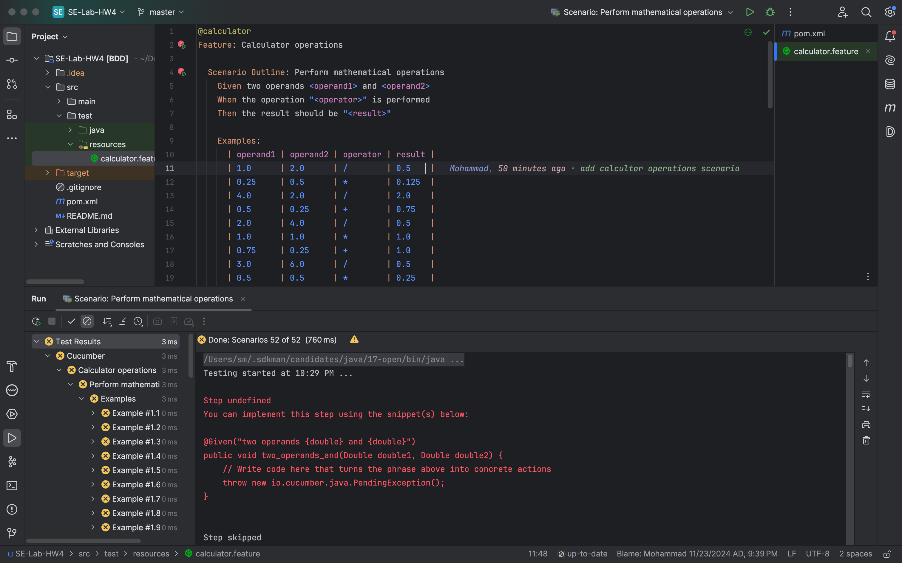
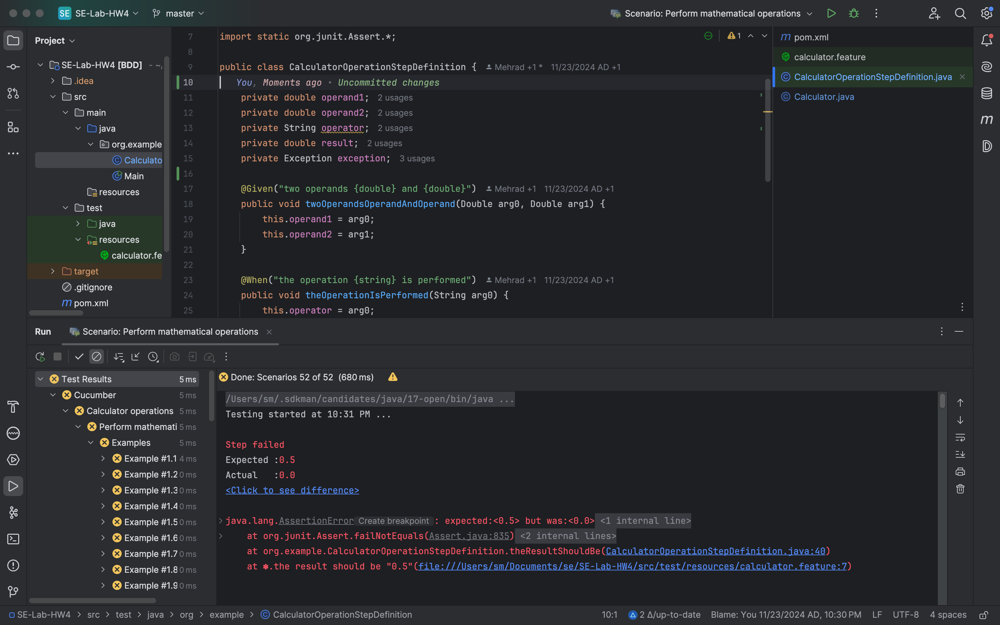
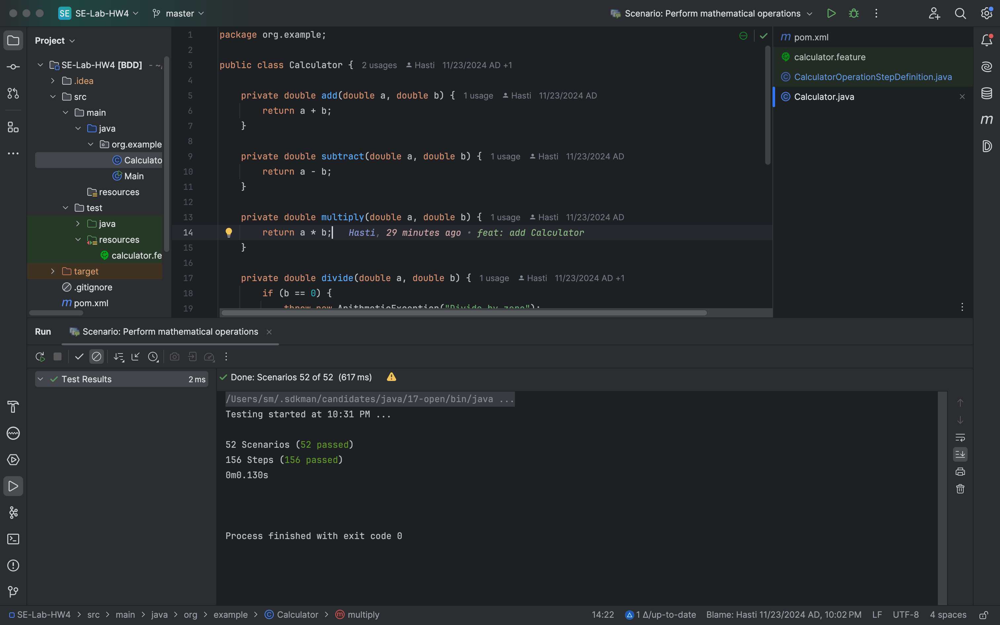

### Kanban Project
https://github.com/users/HastiKarimi/projects/1/views/1

### Steps:
1. ابتدا فایل
   [`calculator.feature`](./src/test/resources/calculator.feature)
را تولید می‌کنیم.

2. آن را مطابق فرمت لازم برای
`cucamber`
نوشته و تست کیس‌های لازم را می‌افزاییم. 

3. سپس با انتخاب کردن گزینه‌ای خود اینتلیج فایل 
[`CalculatorOperationStepDefinition`](./src/test/java/org/example/CalculatorOperationStepDefinition.java)
را تولید می‌کند تا در آن گام‌های تست را تعریف کنیم.

4. در ادامه، ابتدا بدنه‌ی تابع‌های 
Given
و When
و Then
را مطابق نیاز می‌نویسیم و سپس پیاده‌سازی کلاس
[`Calculator`](./src/main/java/org/example/Calculator.java)
را انجام می‌دهیم.
در نهایت با ران کردن تست‌ها پاس شدن آن را چک می‌کنیم.

در پایین  می‌توانید تصاویر مربوط به این گام‌ها را مشاهده کنید:

